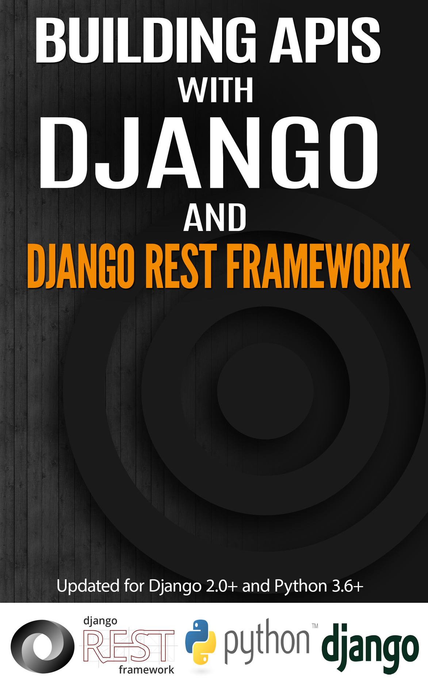

Building APIs with Django and Django Rest Framework
======================================================

Building APIs with Django and DRF takes over where the Django tutorials stop.
In the Django tutorials, you built a regular Django polls app. We will rebuild an API for a similar app.

In the chapters to come, we will build a REST(ish) api with authorization, rate limiting, first with pure Django and then with DRF.
We will cover testing, continuous integration, documentation tools and API collaboration tools.

Chapters:

.. toctree::
   :maxdepth: 2

   introduction
   setup-models-admin
   apis-without-drf
   serailizers
   views-and-generic-views
   more-views-and-viewsets
   access-control
   testing-and-ci

Appendix
==================

.. toctree::
   :maxdepth: 2

   postman
   swagger

* :ref:`genindex`
* :ref:`modindex`
* :ref:`search`

