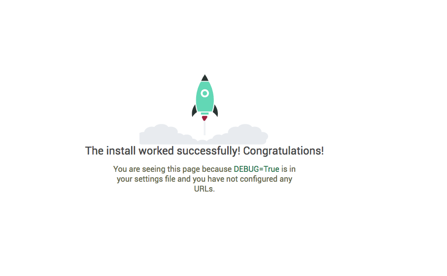

Setup, Models and Admin
=============================

In this tutorial we will walk through a process of creating an API for a basic poll application. We will be using Python 3.6.x, Django 2.0.x and Django Rest Framework 3.7.x for creating API.

First things first, let's install the required modules within a virtual environment.

.. code-block:: python

    mkvirtualenv pollsapi
    pip install Django
    pip install djangorestframework

Creating a project
--------------------

Earliest in order, to create a project we should move to the directory where we would like to store our code. For this go to command line and use cd command. Then trigger the startproject command.

.. code-block:: python

    django-admin startproject pollsapi

This command gives us a 'pollsapi' directoy. The contents of this directory look like this::

    manage.py

    pollsapi/
        __init__.py
        settings.py
        urls.py
        wsgi.py

Database setup
------------------

We will use SQlite database, which is already included with Python. The :code:`pollsapi/settings.py` file would already have the correct settings.

.. code-block:: python

    DATABASES = {
        'default': {
            'ENGINE': 'django.db.backends.sqlite3',
            'NAME': os.path.join(BASE_DIR, 'db.sqlite3'),
        }
    }

Now, use the migrate command which builds the needed database tables in regard to the :code:`django_pollsapi/settings.py` file.

.. code-block:: python

    python manage.py migrate

Creating models
---------------------

Before creating our database models, let us create our pollsapi App.

.. code-block:: python

    python manage.py startapp polls

The above command results in a 'polls' directory containing different files::

    admin.py
    apps.py
    models.py
    tests.py
    views.py

Step in to 'models.py' file and start writing the models. For creating the polls api we are going to create a :code:`Poll` model, a :code:`Choice` model and a :code:`Vote` model. Once we are done with designing our models, the :code:`models.py` file should look like this:

These models are the same as you would have seen in the Django introduction tutorial.

.. code-block:: python

    from django.db import models
    from django.contrib.auth.models import User

    class Poll(models.Model):
        question = models.CharField(max_length=100)
        created_by = models.ForeignKey(User, on_delete=models.CASCADE)
        pub_date = models.DateTimeField(auto_now=True)

        def __str__(self):
            return self.question

    class Choice(models.Model):
        poll = models.ForeignKey(Poll, related_name='choices', on_delete=models.CASCADE)
        choice_text = models.CharField(max_length=100)

        def __str__(self):
            return self.choice_text

    class Vote(models.Model):
        choice = models.ForeignKey(Choice, related_name='votes', on_delete=models.CASCADE)
        poll = models.ForeignKey(Poll, on_delete=models.CASCADE)
        voted_by = models.ForeignKey(User, on_delete=models.CASCADE)

        class Meta:
            unique_together = ("poll", "voted_by")

The above models have been designed in such a way that, it would make our API bulding a smooth process.

Activating models
----------------------

With the simple lines of code in the 'models.py' Django can create a database schema and a Python database-access API which has the capability to access the objects of Poll, Choice, Vote. To create the database tables to our models, 'rest_framework' and 'polls' app needs to be added to the "INSTALLED_APPS" in the 'django_pollsapi/settings' file.

.. code-block:: python

    INSTALLED_APPS = (
    ...
    'rest_framework',
    'polls',
    )

Now, run the :code:`makemigrations` command which will notify Django that new models have been created and those changes needs to be applied to the migration. Run :code:`migrate` command to do the actual migration.

.. code-block:: bash

    $ python manage.py makemigrations polls

    $ python manage.py migrate

Create an empty :code:`urls.py` in your :code:`polls` app.

.. code-block:: python

    urlpatterns = [
    ]

Go to :code:`pollsapi/urls.py` and include the polls urls.

.. code-block:: python
    
    from django.urls import include, re_path
    
    urlpatterns = [
        re_path(r'^', include('polls.urls')),
    ]

Now you can runserver ::

    $ python manage.py runserver

Goto any browser of your choice and hit the url :code:`http://127.0.0.1:8000`

And we are in business, with a Django *Congratulations* page greeting us. (Though we haven't added any API endpoints yet.)

We will be adding API endpoints for creating and viewing polls in the next chapter.

Setting up the admin
++++++++++++++++++++++

You should register :code:`Poll` and :code:`Choice` in the admin like this.

.. code-block:: python

    from django.contrib import admin

    from .models import Poll, Choice

    admin.site.register(Poll)
    admin.site.register(Choice)
