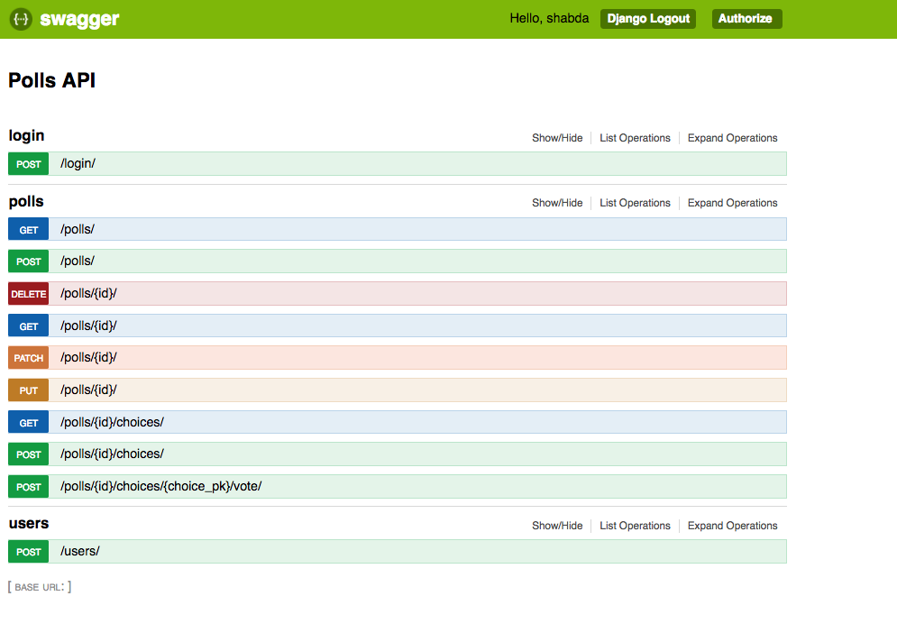
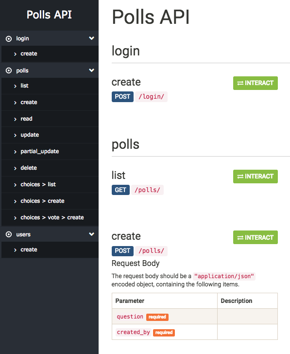

Documenting APIs (with Swagger and more)
==========================================================

In this chapter we will see how to document our API.

As you build your API, you would need to document the API to collaborate with other people. In most companies and teams, the developer using the API is different from the one building them. API documentation and collaboration tools, become even more important in such an environment.

Swagger is a tool used to understand the capabilities of the service without access to source code, documentation, or through network traffic inspection. In simple terms, with swagger you can see what all API end points are available for a web application. You can use swagger for testing the requests and responses of the API endpoints.

DRF comes with its own tool, coreapi, for documenting and interacting with the API.

We will use both coreapi and swagger to document our API.

Adding swagger documentation
-----------------------------

Install django-rest-swagger

.. code-block:: bash

    pip install django-rest-swagger

Update your :code:`settings.py`

.. code-block:: python

    INSTALLED_APPS = [
        # ...
        'polls',
        'rest_framework_swagger',
    ]

Add swagger to your urls.

.. code-block:: python

    from rest_framework_swagger.views import get_swagger_view

    schema_view = get_swagger_view(title='Polls API')

    # ...
    urlpatterns = [
        # ...
        path(r'swagger-docs/', schema_view),
    ]

Navigate to `/swagger-docs/`. And your swagger docs are ready in all their glory.

Using coreapi for documentation
--------------------------------

Install coreapi

.. code-block:: bash

    pip install coreapi

Add coreapi urls to your urls.

.. code-block:: python

    from rest_framework.documentation import include_docs_urls
    # ...

    urlpatterns = [
        # ...
        path(r'docs/', include_docs_urls(title='Polls API')),
    ]

And your coreapi docs are ready in all their glory.

