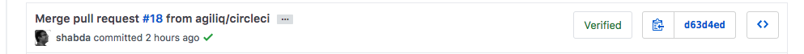

Testing and Continuous Integeration
==========================================

In this chapter we will add test to our API.

DRF provides a few important classes which makes testing APIs simpler. We will be using these classes later in the chapter in our tests.

- :code:`APIRequestFactory`: This is similar to Django's :code:`RequestFactory`. It allows you to create requests with any http method, which you can then pass on to any view method and compare responses.
- :code:`APIClient`: similar to Django's :code:`Client`. You can GET or POST a URL, and test responses.
- :code:`APITestCase`: similar to Django's :code:`TestCase`. Most of your tests will subclass this.

Now lets us write test cases to our polls application.

Creating Test Requests
------------------------
Django's 'Requestfactory' has the capability to create request instances which allow us in testing view functions individually. Django Rest Framework has a class called 'APIRequestFactory' which extends the standard Django's  'RequestFactory'. This class contains almost all the http verbs like .get(), .post(), .put(), .patch() et all.

Syntax for Post request:

.. code-block:: python

    factory = APIRequestFactory()
    request = factory.post(uri, post data)

Lets add a test for the polls list.

.. code-block:: python

    from rest_framework.test import APITestCase
    from rest_framework.test import APIRequestFactory

    from polls import apiviews

    class TestPoll(APITestCase):
        def setUp(self):
            self.factory = APIRequestFactory()
            self.view = apiviews.PollViewSet.as_view({'get': 'list'})
            self.uri = '/polls/'

        def test_list(self):
            request = self.factory.get(self.uri)
            response = self.view(request)
            self.assertEqual(response.status_code, 200,
                             'Expected Response Code 200, received {0} instead.'
                             .format(response.status_code))

In the above lines of code, we are trying to access the PollList view. We are asserting that the HTTP response code is 200.

Now run the test command.

.. code-block:: python

    python manage.py test

And it will display the below message.

.. code-block:: bash

    Creating test database for alias 'default'...
    System check identified no issues (0 silenced).
    F
    ======================================================================
    FAIL: test_list (polls.tests.TestPoll)
    ----------------------------------------------------------------------
    Traceback (most recent call last):
      File "/Users/shabda/repos/building-api-django/pollsapi/polls/tests.py", line 19, in test_list
        .format(response.status_code))
    AssertionError: 401 != 200 : Expected Response Code 200, received 401 instead.

    ----------------------------------------------------------------------
    Ran 1 test in 0.002s

    FAILED (failures=1)
    Destroying test database for alias 'default'...

Ouch! Our test failed. This happened because the view is not accessible without authentication. So we need to create a user and test the view after getting authenticated.

Testing APIs with authentication
------------------------------------

To test apis with authentication, a test user needs to be created so that we can make requests in context of that user. Let's create a test user. Change your tests to

.. code-block:: python

    from django.contrib.auth import get_user_model
    from rest_framework.authtoken.models import Token
    # ...

    class TestPoll(APITestCase):
        def setUp(self):
            # ...
            self.user = self.setup_user()
            self.token = Token.objects.create(user=self.user)
            self.token.save()

        @staticmethod
        def setup_user():
            User = get_user_model()
            return User.objects.create_user(
                'test',
                email='testuser@test.com',
                password='test'
            )

        def test_list(self):
            request = self.factory.get(self.uri, 
                HTTP_AUTHORIZATION='Token {}'.format(self.token.key))
            request.user = self.user
            response = self.view(request)
            self.assertEqual(response.status_code, 200,
                             'Expected Response Code 200, received {0} instead.'
                             .format(response.status_code))

Now run the test command.

.. code-block:: python

    python manage.py test

You should get this response

.. code-block:: bash

    Creating test database for alias 'default'...
    System check identified no issues (0 silenced).
    .
    ----------------------------------------------------------------------
    Ran 1 test in 0.119s

    OK
    Destroying test database for alias 'default'...

Using :code:`APIClient`
--------------------------

The same test can be written using :code:`APIClient`. It has :code:`get`, :code:`.post` and family. Unlike creating requests first, with :code:`APIClient` you can GET or POST to a url directly and get a response.

Add a test like this:

.. code-block:: python

    from rest_framework.test import APIClient

    # ...

    class TestPoll(APITestCase):
        def setUp(self):
            self.client = APIClient()
            # ...

        # ...
        def test_list2(self):
            response = self.client.get(self.uri)
            self.assertEqual(response.status_code, 200,
                             'Expected Response Code 200, received {0} instead.'
                             .format(response.status_code))

Let us test it now.

.. code-block:: bash

    python manage.py test polls.tests.TestPoll

    Creating test database for alias 'default'...
    System check identified no issues (0 silenced).
    F
    ======================================================================
    FAIL: test_list2 (polls.tests.TestPoll)
    ----------------------------------------------------------------------
    Traceback (most recent call last):
      File "/Users/shabda/repos/building-api-django/pollsapi/polls/tests.py", line 37, in test_list2
        .format(response.status_code))
    AssertionError: 401 != 200 : Expected Response Code 200, received 401 instead.

    ----------------------------------------------------------------------
    Ran 1 test in 0.136s

    FAILED (failures=1)
    Destroying test database for alias 'default'...

We are seeing the same failure we saw in the test with :code:`APIRequestFactory`. You can login a :code:`APIClient` by calling
:code:`APIClient.login`. Lets update the test.

.. code-block:: python

    class TestPoll(APITestCase):
        # ...

        def test_list2(self):
            self.client.login(username="test", password="test")
            response = self.client.get(self.uri)
            self.assertEqual(response.status_code, 200,
                             'Expected Response Code 200, received {0} instead.'
                             .format(response.status_code))

.. code-block:: bash

    python manage.py test polls.tests.TestPoll
    Creating test database for alias 'default'...
    System check identified no issues (0 silenced).
    .
    ----------------------------------------------------------------------
    Ran 1 test in 0.260s

    OK
    Destroying test database for alias 'default'...

Voilà! The test passed successfully.

:code:`.post` and create
--------------------------------------------------

We now know how to test our GET APIs. We can use the :code:`APIClient` with :code:`.post` method this time.

Let us try creating a new poll by sending the 'question', and 'created_by' parameters which are needs in the POST method. The test function looks as follows.

.. code-block:: python

    class TestPoll(APITestCase):

        # ...
        def test_create(self):
            self.client.login(username="test", password="test")
            params = {
                "question": "How are you?",
                "created_by": 1
                }
            response = self.client.post(self.uri, params)
            self.assertEqual(response.status_code, 201,
                             'Expected Response Code 201, received {0} instead.'
                             .format(response.status_code))

We are asserting that the the http code is 201 if the test passes succesfully. Lets run the tests.

.. code-block:: bash

    python manage.py test polls.tests.TestPoll.test_create

    Creating test database for alias 'default'...
    System check identified no issues (0 silenced).
    .
    ----------------------------------------------------------------------
    Ran 1 test in 0.267s

    OK
    Destroying test database for alias 'default'...

Time to celebrate with the API :)

Continuous integration with CircleCI
---------------------------------------

We have the tests, but we also want it to run on every commit. If you are using Github, CircleCI provides a very well in integrated service to run your tests. We will use Circleci. v2

We can configure our application to use Circle CI  by adding a file named :code:`.circleci/config.yml` which is a YAML(a human-readable data serialization format) text file. It automatically detects when a commit has been made and pushed to a Github repository that is using CircleCI, and each time this happens, it will try to build the project and runs tests. The build failure or success is notified to the developer.

Setting up CircleCI
---------------------------------------

- Sign-in: To get started with Circle CI we can sign-in with our github account on circleci.com.
- Activate Github webhook: Once the Signup process gets completed we need to enable the service hook in the github profile page.
- Add .circle/config.yml: We should add the yml file to the project.

Writing circle configuration file
---------------------------------------

In order for circle CI to build our project we need to tell the system a little bit about it. we will be needed to add a file named :code:`.circleci/config.yml` to the root of our repository. We also need to create a :code:`pollsapi/requirements.txt` to define our dependencies.

Add this to your :code:`pollsapi/requirements.txt`

.. code-block:: text

    Django==2.0.3
    djangorestframework==3.7.7

And then add this to :code:`.circleci/config.yml`

.. code-block:: yaml

  version: 2
  jobs:
    build:
      docker:
        # specify the version you desire here
        - image: circleci/python:3.6.1

      working_directory: ~/repo

      steps:
        - checkout

        # Download and cache dependencies
        - restore_cache:
            keys:
            - v1-dependencies-{{ checksum "pollsapi/requirements.txt" }}
            # fallback to using the latest cache if no exact match is found
            - v1-dependencies-

        - run:
            name: install dependencies
            command: |
              python3 -m venv venv
              . venv/bin/activate
              pip install -r pollsapi/requirements.txt

        - save_cache:
            paths:
              - ./venv
            key: v1-dependencies-{{ checksum "requirements.txt" }}

        - run:
            name: run tests
            command: |
              . venv/bin/activate
              cd pollsapi
              python manage.py test

        - store_artifacts:
            path: test-reports
            destination: test-reports

Below are the important keywords that are used in writting circleci config.yml file.

- :code:`image`: Defines the base image including the language and version to use
- :code:`run`: It specifies a :code:`command` which will be run to setup environent and run tests. :code:`pip install -r pollsapi/requirements.txt` sets up the environment and :code:`pip install -r pollsapi/requirements.txt`

If everything passed successfully, you should see a green checkmark

Congratulations, you have tests running in a CI environment.

From now onwards whenever we push our code to our repository a new build will be created for it and the tests will run.

We are at the end of the first part of our book. You can read the appendix, which tell about some documentation tools and api consumption tools. Go forward and build some amazing apps and apis.

