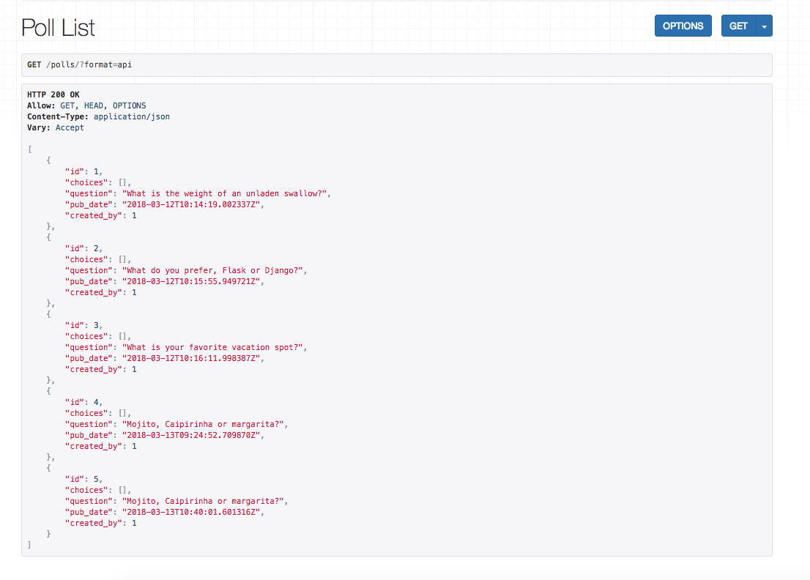
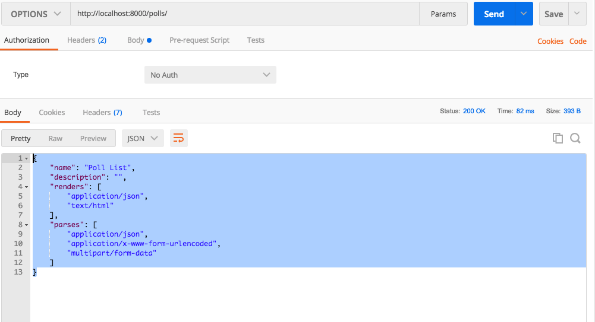
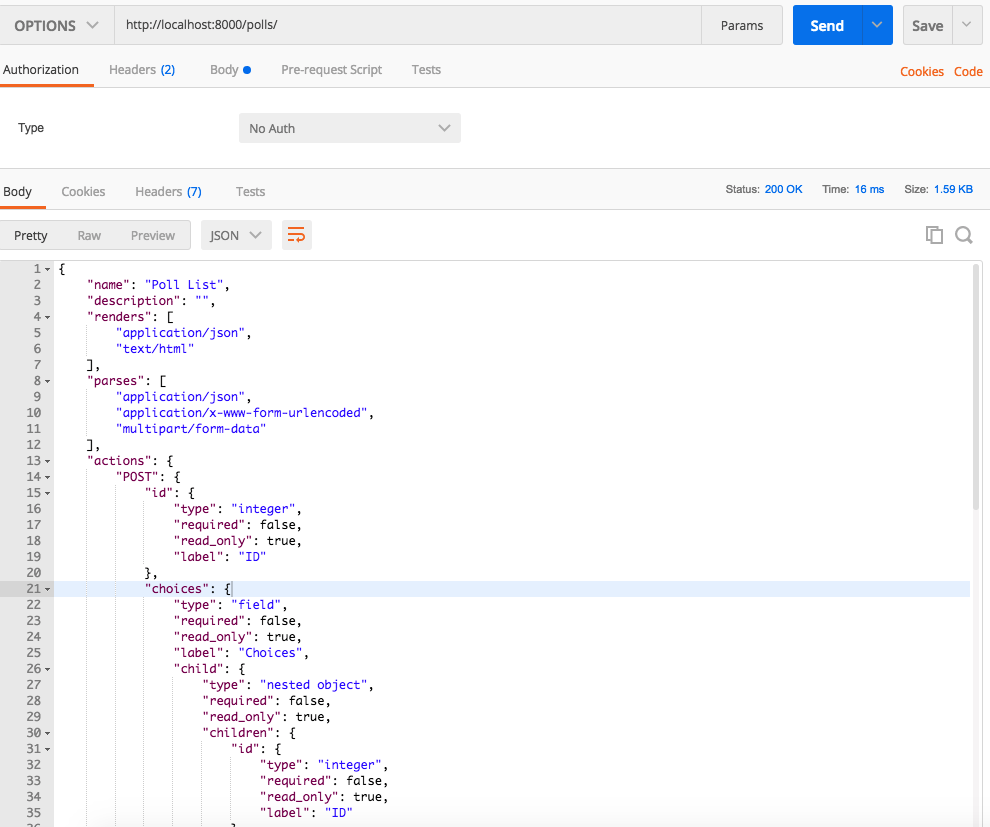

Views and Generic Views
============================

In this chapter, we will create views using :code:`APIVIew`, and :code:`generics.ListCreateAPIView` and family.

Creating Views with :code:`APIView`
-----------------------------------------

To start with, we will use the :code:`APIView` to build the polls list and poll detail API we built in the chapter, :doc:`apis-without-drf`.

Add this to a new file :code:`polls/apiviews.py`

.. code-block:: python

    from rest_framework.views import APIView
    from rest_framework.response import Response
    from django.shortcuts import get_object_or_404

    from .models import Poll, Choice
    from  .serializers import PollSerializer

    class PollList(APIView):
        def get(self, request):
            polls = Poll.objects.all()[:20]
            data = PollSerializer(polls, many=True).data
            return Response(data)

    class PollDetail(APIView):
        def get(self, request, pk):
            poll = get_object_or_404(Poll, pk=pk)
            data = PollSerializer(poll).data
            return Response(data)

And change your :code:`urls.py` to

.. code-block:: python

    from django.urls import path

    from .apiviews import PollList, PollDetail

    urlpatterns = [
        path("polls/", PollList.as_view(), name="polls_list"),
        path("polls/<int:pk>/", PollDetail.as_view(), name="polls_detail")
    ]

DRF comes with a browsable api, so you can directly open :code:`http://localhost:8000/polls/` in the browser. It looks like this

You can now do an :code:`options` request to `/polls/`, which gives

.. code-block:: json

    {
        "name": "Poll List",
        "description": "",
        "renders": [
            "application/json",
            "text/html"
        ],
        "parses": [
            "application/json",
            "application/x-www-form-urlencoded",
            "multipart/form-data"
        ]
    }

This is how it looks like in postman.

Using DRF generic views to simplify code
-----------------------------------------

The :code:`PollList` and :code:`PollDetail` get the work done, but there are bunch of common operations, we can do it in abstract away.

The generic views of Django Rest Framework help us in code reusablity. They infer the response format and allowed methods from the serializer class and base class.

Change your :code:`apiviews.py` to the below code, and leave urls.py as is.

.. code-block:: python

    from rest_framework import generics

    from .models import Poll, Choice
    from .serializers import PollSerializer, ChoiceSerializer,\
        VoteSerializer

    class PollList(generics.ListCreateAPIView):
        queryset = Poll.objects.all()
        serializer_class = PollSerializer

    class PollDetail(generics.RetrieveDestroyAPIView):
        queryset = Poll.objects.all()
        serializer_class = PollSerializer

With this change, GET requests to :code:`/polls/` and :code:`/polls/<pk>/`, continue to work as was, but we have a more data available with OPTIONS.

Do an OPTIONs request to :code:`/polls/`, and you will get a response like this.

.. code-block:: javascript

    {
        "name": "Poll List",
        "description": "",
        "renders": [
            "application/json",
            "text/html"
        ],
        "parses": [
            "application/json",
            "application/x-www-form-urlencoded",
            "multipart/form-data"
        ],
        "actions": {
            "POST": {
                "id": {
                    "type": "integer",
                    "required": false,
                    "read_only": true,
                    "label": "ID"
                },
                // ...
                },
                "question": {
                    "type": "string",
                    "required": true,
                    "read_only": false,
                    "label": "Question",
                    "max_length": 100
                },
                "pub_date": {
                    "type": "datetime",
                    "required": false,
                    "read_only": true,
                    "label": "Pub date"
                },
                "created_by": {
                    "type": "field",
                    "required": true,
                    "read_only": false,
                    "label": "Created by"
                }
            }
        }
    }

This tells us

* Our API now accepts POST
* The required data fields
* The type of each data field.

Pretty nifty! This is what it looks like in Postman.

More generic views
------------------------

Let us add the view to create choices and for voting. We will look more closely at this code shortly.

.. code-block:: python

    from rest_framework import generics

    from .models import Poll, Choice
    from .serializers import PollSerializer, ChoiceSerializer, VoteSerializer

    class PollList(generics.ListCreateAPIView):
        queryset = Poll.objects.all()
        serializer_class = PollSerializer

    class PollDetail(generics.RetrieveDestroyAPIView):
        queryset = Poll.objects.all()
        serializer_class = PollSerializer

    class ChoiceList(generics.ListCreateAPIView):
        queryset = Choice.objects.all()
        serializer_class = ChoiceSerializer

    class CreateVote(generics.CreateAPIView):
        serializer_class = VoteSerializer

Connect the new apiviews to urls.py.

.. code-block:: python

    # ...
    from .apiviews import ChoiceList, CreateVote, # ...

    urlpatterns = [
        # ...
        path("choices/", ChoiceList.as_view(), name="choice_list"),
        path("vote/", CreateVote.as_view(), name="create_vote"),

    ]

There is a lot going on here, let us look at the attributes we need to override or set.

- :code:`queryset`: This determines the initial queryset. The queryset can be further filtered, sliced or ordered by the view.
- :code:`serializer_class`: This will be used for validating and deserializing the input and for serializing the output.

We have used three different classes from :code:`rest_framework.generic`. The names of the classes are representative of what they do, but lets quickly look at them.

- :code:`ListCreateAPIView`: Get a list of entities, or create them. Allows GET and POST.
- :code:`RetrieveDestroyAPIView`: Retrieve an individual entity details, or delete the entity. Allows GET and DELETE.
- :code:`CreateAPIView`: Allows creating entities, but not listing them. Allows POST.

Create some choices by POSTing to :code:`/choices/`.

.. code-block:: json

    {
        "choice_text": "Flask",
        "poll": 2
    }

The response looks like this

.. code-block:: json

    {
        "id": 4,
        "votes": [],
        "choice_text": "Flask",
        "poll": 2
    }

You can also retrieve the :code:`Poll` to by doing a :code:`GET` to :code:`/polls/<pk>/`. You should get something like this

.. code-block:: json

    {
        "id": 2,
        "choices": [
            {
                "id": 3,
                "votes": [],
                "choice_text": "Django",
                "poll": 2
            },
            {
                "id": 4,
                "votes": [],
                "choice_text": "Flask",
                "poll": 2
            }
        ],
        "question": "What do you prefer, Flask or Django?",
        "pub_date": "2018-03-12T10:15:55.949721Z",
        "created_by": 1
    }

If you make a mistake while POSTing, the API will warn you. POST a json with :code:`choice_text` missing to :code:`/choices/`.

.. code-block:: json

    {
        "poll": 2
    }

You will get a response like this

.. code-block:: json

    {
        "choice_text": [
            "This field is required."
        ]
    }

Check the status code is 400 Bad Request.

Next Steps
--------------

We have working API at this point, but we can simplify our API with a better URL design and remove some code duplication using viewsets. We will be doing that in the next chapter.
